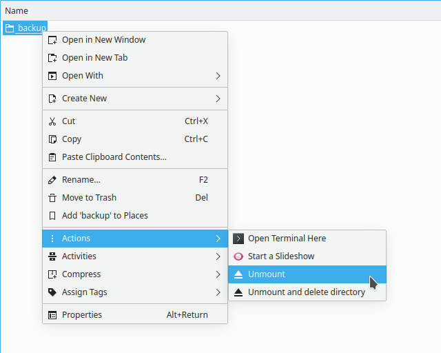

## Dolphin service menu: Directory unmounter

Unmount anything mounted in a directory using "Unmount" from service menu. It can also try to delete directory after mount with "Unmount and delete directory" option.

It first tries to unmount without root privileges using `fusermount`, and if that doesn't work, it uses `pkexec` to execute umount with root privileges.

**Supported languages:** Dutch, English, Russian  

Adding support for your language is very simple:

Just add `Name[xx]=…` translated entries for it in `.desktop` file and create a pull request :wink:  
To do so in GitHub web interface, you can edit file right there, then click `Propose changes` → `Create pull request`.

### Installation
Place `.desktop` file in `~/.local/share/kio/servicemenus`

### Screenshots

